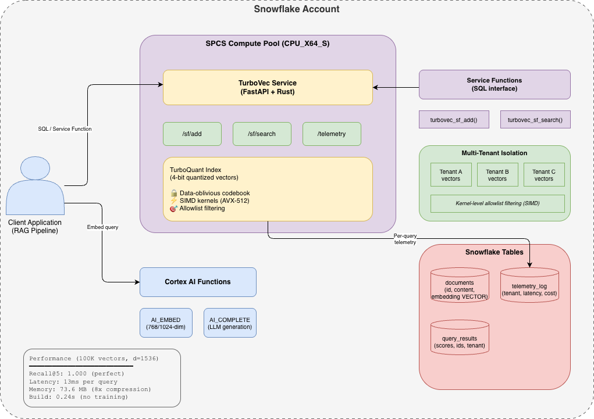

# TurboVec on Snowpark Container Services (SPCS)

A quickstart guide for deploying [TurboVec](https://github.com/RyanCodrai/turbovec) — a high-performance, privacy-preserving vector index — on Snowpark Container Services.

## What You'll Build

- A TurboVec vector search service running inside Snowflake's compute infrastructure
- A multi-tenant RAG pipeline with kernel-level tenant isolation
- Per-query telemetry that feeds directly into Snowflake tables for cost governance

## What You'll Learn

- How to deploy a custom vector index on SPCS
- How TurboVec's data-oblivious quantization provides 8-16x memory compression
- How kernel-level filtered search enables multi-tenant vector isolation
- How to integrate TurboVec with Snowflake's Cortex AI functions for end-to-end RAG

## Architecture

## Prerequisites

- A Snowflake account with Snowpark Container Services enabled
- Docker installed locally (for building the image)
- Snow CLI installed (`snow spcs image-registry login` handles auth)
- Python 3.9+ with `pip install turbovec faiss-cpu numpy datasets pyarrow` (for local benchmarks)

## Guides

1. **[TurboVec on SPCS](guides/turbovec-on-spcs.md)** — Deploy TurboVec, load the public DBpedia dataset, and run the 3-way benchmark (TurboVec vs Snowflake Native vs Cortex Search)

## Benchmark Results (Verified)

Dataset: [Qdrant/DBpedia OpenAI 1536-dim](https://huggingface.co/datasets/Qdrant/dbpedia-entities-openai3-text-embedding-3-large-1536-1M) (100K vectors, public)

| Method | Recall@5 | Latency | Memory | Training |
|--------|----------|---------|--------|----------|
| Snowflake Native (FP32) | 1.000 | ~500ms (warehouse) | 585.9 MB | N/A |
| **TurboVec 4-bit (SPCS)** | **1.000** | **13ms** | **73.6 MB** | **None** |
| FAISS PQ (local, 100K) | 0.964 | 0.86ms | 146.5 MB | 12.7s |

Tested on Snowflake account SFSENORTHAMERICA-NAVNIT_AWS_CAPSTONE with CPU_X64_S compute pool.

## Why TurboVec on SPCS?

| Feature | TurboVec | Snowflake Native Vectors | External Vector DB |
|---------|----------|--------------------------|-------------------|
| Compression | 8x (4-bit) to 16x (2-bit) | None (FP32) | Varies (2-4x) |
| Multi-tenant filtering | Kernel-level (SIMD) | SQL WHERE clause | Application-level |
| Data leaves platform | No | No | Yes |
| Cost attribution | Per-query telemetry | Per-warehouse | None |
| Training required | None (data-oblivious) | N/A | PQ/codebook training |
| Search latency (10K, d=1536) | 2.2ms | ~200ms (warehouse) | Varies |

## Quick Links

- [TurboVec GitHub](https://github.com/RyanCodrai/turbovec)
- [TurboQuant Paper (ICLR 2026)](https://arxiv.org/abs/2504.19874)
- [Snowpark Container Services Docs](https://docs.snowflake.com/en/developer-guide/snowpark-container-services/overview)
- [Snowflake Cortex AI Functions](https://docs.snowflake.com/en/user-guide/snowflake-cortex/aisql)
